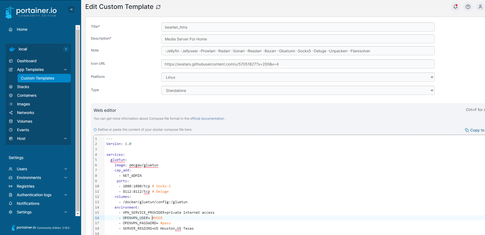

# Home-LAN-Fun
Repository for tutorials showing how to create home servers for fun using docker and portainer. I originally set up mine using the [Pi-Hosted](https://github.com/pi-hosted/pi-hosted) repo by [Novaspirit](https://www.youtube.com/channel/UCrjKdwxaQMSV_NDywgKXVmw) who both has a great repo and an amaziing youtube series following allong. The area where this mainly differs is that i have created stacks complete with config with multiple containers to quickly spin up applications preset with variables. This repository is best when used in conjuntion with my [youtube series](www.youtube.com) explaining the full architecture of my home lab.

## App Template
I've included for you a template of a few stacks, each stack contains multiple containers that I use for various uses, the vision is to have a one-click creation of a media server eventually, core network tools, and general apps that I use in my home lab. Additionally, I wanted to include the option to edit the docker-compose.yml to choose what apps are included in the stack and easily change the environmental variables to match your home network settings.

I like to edit the compose and config files in vscode through ssh connection. it really makes the process much easier in setup and imagining the file structure. I have tried to recreate my file structure within this repo in order to see in the compose files why ive decided to map the volumes the way i have. Also there is sort of an order of operaions for best results, following the youtube guide I will try to do things in order so it works best when you follow along.



## Apps List
[Here](/docs/App-Catalog.md) you can see the list of apps, what stack I have them in, and some key links to doccumentation so you can edit the variables easily. I would recomend the network stack and media server being hosted on seprate host (or VMs). I think it works best when each stack gets their own dedicated IP to work with. If you follow with my [youtube series](www.youtube.com) you can see start to finish how ive architechted my server including my file shares and permissions. Both of which I would say are essential for the media server stack.

## Instalation Steps
For the setup, im going to assume that you already have some sort of hypervisor or base os installed on your hardware as well as some form of network attached storage. Its not essential and all of the services will work just fine when installed on your local storage if that is how you have it archetechted.

For refrence, my setup sort of looks like this at a high level


 ### Setup OS
 On a fresh debian install, you will want to set up the OS as i lay out below. With the os setup this waay you can run these containers easily using data from your shared drives. If you intend to use local directories you can skip this step.

 **Login as root**<br>
 `apt update && apt upgrade -y`
 `apt install sudo -y`<br>
 Logout

 **Login as user and install cifs**<br>
 `sudo apt install cifs-utils`

 **Make directory for mount**<br>
 `sudo mkdir /mnt/{directory} (repeat for each mount location)`

 **Edit fstab**<br>
 `sudo nano /etc/fstab`<br>
 and connect the mounts to your shares by inputting this line in the fstab.
 ```
 //{share ip}/{sharen name} /mnt/{directory} cifs credentials=/root/smbcredentials,uid=1000,gid=1000,noauto,x-systemd.automount 0 0
 ```
 you will need to do this for each drive location. In my instance i only use one and it is /mnt/media.

 **Create credentials file**<br>
 `sudo nano /root/smbcredentials`<br>
 paste in the following
 ```
 user={username}
 password={password}
 ```

 **Lastly mount all drives and reboot**<br>
 `sudo mount -a`
 `reboot`<br>
 ### Setup SSH with VS Code
 
 ### Install Docker
 Again, just a little extra bit of setup i like to do befor moving onto the portainer install is to set my network configuration to my liking.

 **Edit interfaces**<br>
 `sudo nano /etc/network/interfaces`<br>
 you will want to find this portion and edit it to your liking
 ```
 # The primary network interface
 auto enp0s5
 iface enp0s5  inet static
 address 192.168.2.236
 netmask 255.255.255.0
 gateway 192.168.2.254
 dns-domain sweet.home
 dns-nameservers 192.168.2.254 1.1.1.1 8.8.8.8
 ``` 
 save and reboot.<br>

 **Docker Setup**<br>
 `sudo spt install curl -y`<br>
 `curl -fsSL https://get.docker.com -o get-docker.sh`<br>
 `sudo sh get-docker.sh`<br>

 **Add user to docker**<br>
 `sudo usermod -aG docker {user}`

 ### Add Template

**Create Directories**<br>
 `git clone <repository-url> <target-directory>`<br>
 `cd /apps`<br>

 (you can take the whole directory, or just specific apps its basically premade docker-compose files and config.yml in some cases)<br>
 
**Template Links**<br>
 |Architechture|OS|Repository URL|
 |:-----:|:----:|:-----------------:|
 |AMD64|Debian|https://github.com/Jarrodb22/BearLAN/tree/main/apps|

 You're done! Now just click App Templates and deploy applications!
 
## ARM32 support
ARM32 support is being dropped, for that reason, i do not have any environment in my home lab using it and this repo is only tested to support AMD64.

## Youtube Series
|Episode|Video Link|Title|Docs Link|
|:---|:---:|:------------------------------:|:--------:|
|No.1| [](https://youtube.com) | Install Proxmox, Setup TrueNAS shares and permissions | [](https://docs.linuxserver.io/images/docker-bazarr/) |
|No.2| [](https://youtube.com) | Buid VMS, Setup OS and Install Docker | [](https://docs.linuxserver.io/images/docker-bazarr/) |
|No.3| [](https://youtube.com) | Setup Adguard and Traefik | [](https://docs.linuxserver.io/images/docker-bazarr/) |
|No.5| [](https://youtube.com) | Setup gluetun vpn and media server | [](https://docs.linuxserver.io/images/docker-bazarr/) |
|No.6| [](https://youtube.com) | Setup Frigate NVR and Homeassistant | [](https://docs.linuxserver.io/images/docker-bazarr/) |
|No.7| [](https://youtube.com) | Setup wireguard VPN server | [](https://docs.linuxserver.io/images/docker-bazarr/) |

## Acknowledgment
- Template is inspired by the work from [Pi-Hosted](https://github.com/pi-hosted/pi-hosted) Portainer App Template branch in May 2024