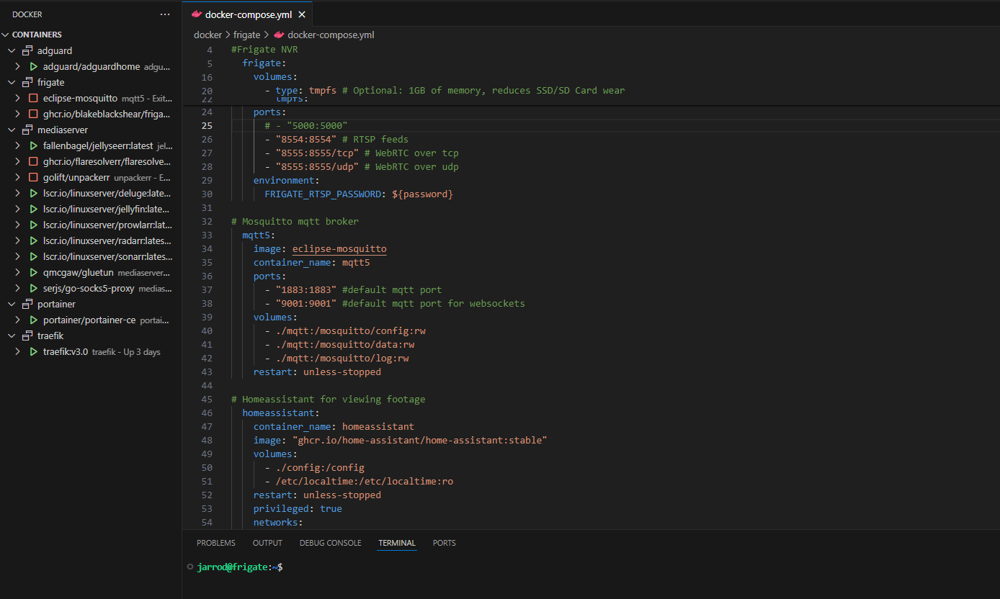

# Home-LAN-Fun
Repository for tutorials showing how to create home servers for fun using docker, having all the services on a local DNS with authorized certs from Let's Encrypt. I originally set up my lab using the [Pi-Hosted](https://github.com/pi-hosted/pi-hosted) repo by [Novaspirit](https://www.youtube.com/channel/UCrjKdwxaQMSV_NDywgKXVmw) who both has a great repo and an amazing youtube series following along. I have created this so I can easily have docker-compose complete with config for multiple containers to quickly spin up applications preset with variables and proper file structure without using portainer. This repository is best used in conjunction with my [youtube series](www.youtube.com) explaining the full architecture of my home lab and edited from VS Code.

## App Template
I've included for you a template of a few stacks, each stack contains one or a few containers that I use for various uses, the vision is to have a simple way to spin up a bunch of media services, core network tools, and general apps that I use in my home lab. Additionally, I wanted to include the option to edit the docker-compose.yml and manage everything from docker-compose to easily see the file structure and edit the stacks to match your environmental and network settings.

I like to edit the compose and config files in vscode through the SSH connection. It makes the process much easier in setting up and managing the file structure. I have tried to recreate my file structure within this repo to see in the compose files why I've decided to map the volumes the way I have. Also, there is sort of an order of operations for best results, following the YouTube guide I will try to do things in order so it works best when you follow along. If you don't want to watch you can see the series overview to get an idea. I will also include documentation for each episode for you to follow along with



## Apps List
[Here](/docs/App-Catalog.md) you can see the list of apps, how I categorize them, and some key links to documentation so you can edit the variables easily. I would recommend hosting them all on the same machine if possible. For some containers, I think it's best (or easiest) when you use a macvlan. If you follow my [YouTube series](www.youtube.com) you can see from start to finish how I've architected my server including my file shares and permissions. Both of which I would say are essential for the media server portion.

## Installation Steps
For the setup, I'm going to assume that you already have some sort of hypervisor or base OS installed on your hardware as well as some form of network-attached storage. It's not essential to have a network drive, and all of the services will work just fine when installed on your local storage if that is how you have it architected.

For reference, my setup sort of looks like this at a high level:


 ### Setup OS
 On a fresh Debian install, you will want to set up the OS as I lay out below. With the OS setup this way you can run these containers easily using data from your shared drives. If you intend to use local directories you can skip this step.

 **Login as root**<br>
 `apt update && apt upgrade -y`
 `apt install sudo -y`<br>
 Logout

 **Login as user and install cifs**<br>
 `sudo apt install cifs-utils`

 **Make directory for mount**<br>
 `sudo mkdir /mnt/{directory} (repeat for each mount location)`

 **Edit fstab**<br>
 `sudo nano /etc/fstab`<br>
 and connect the mounts to your shares by inputting this line in the fstab.
 ```
 //{share ip}/{sharen name} /mnt/{directory} cifs credentials=/root/smbcredentials,uid=1000,gid=1000,noauto,x-systemd.automount 0 0
 ```
 you will need to do this for each drive location. In my instance, I only use one and it is /mnt/media.

 **Create credentials file**<br>
 `sudo nano /root/smbcredentials`<br>
 paste in the following
 ```
 user=#username
 password=#password
 ```

 **Lastly mount all drives and reboot**<br>
 `sudo mount -a`
 `reboot`<br>
 
 ### Install Docker
 Again, just a little extra bit of setup I like to do before moving onto the container install is to set my network configuration to my liking.

 **Edit interfaces**<br>
 `sudo nano /etc/network/interfaces`<br>
 you will want to find this portion and edit it to your liking
 ```
 # The primary network interface
 auto enp0s5
 iface enp0s5  inet static
 address 192.168.2.236
 netmask 255.255.255.0
 gateway 192.168.2.254
 dns-nameservers 192.168.2.254 1.1.1.1 8.8.8.8
 ``` 
 save and reboot.<br>

 **Docker Setup**<br>
 `sudo spt install curl -y`<br>
 `curl -fsSL https://get.docker.com -o get-docker.sh`<br>
 `sudo sh get-docker.sh`<br>

 **Add user to docker**<br>
 `sudo usermod -aG docker {user}`

  ### Setup SSH with VS Code
  On your dev machine install VS Code, if you haven't already, then I  think it's helpful to add the extensions for docker and remote SSH. With this you should have the ability to do most of the editing and management from within the vscode app and with the docker extensions it will show you which directories have running containers.

  To setup, launch the remote SSH config file and paste it to your host(s) using this format
 ```
Host {Host IP}
    User {username}
    Password {password} 
    Port 22
```
 

 ### Add Template

**Create Directories**<br>
In your users directory run this command:
 
 `git clone <repository-url> <target-directory>`<br>
 
(You will get the whole directory, but this is ultimately like other templates, you just import the file structure premade. I think it is better this way because I like to operate from VS CODE which I find to be better than portainer, however, you can install portainer just as well)
 
 `git remote remove origin <repository-url>`<br>

  **IMPORTANT:** Disconnect the remote from the repo, since there are production files we don't want to commit any of them as it will likely include some sort of sensitive information.

 
**Template Links**<br>
 |Architechture|OS|Repository URL|
 |:-----:|:----:|:-----------------:|
 |AMD64|Debian|https://github.com/Jarrodb22/docker/tree/main|

 You're done! Now you can input your variables and run the compose files.
 
## ARM32 support
ARM32 support is being dropped, for that reason, I do not have any environment in my home lab using it and this repo is only tested to support AMD64.

## Youtube Series
|Episode|Video Link|Title|Docs Link|
|:---:|:-----:|:-----------------------------:|:-----:|
|No.1| [](https://youtube.com) | Install Proxmox, Setup IOMMU passthrough | [](/docs/ep1.md) |
|No.1| [](https://youtube.com) | VM Setup, TrueNAS shares and permissions| [](/docs/ep2.md) |
|No.3| [](https://youtube.com) | Setup host OS and Install Docker | [](/docs/ep3.md) |
|No.4| [](https://youtube.com) | Setup Adguard and Traefik | [](/docs/ep4.md) |
|No.5| [](https://youtube.com) | Setup gluetun vpn and media server | [](/docs/ep5.md) |
|No.6| [](https://youtube.com) | Setup Frigate NVR and Homeassistant | [](/docs/ep6.md/) |
|No.7| [](https://youtube.com) | Setup wireguard VPN server | [](/docs/ep7.md) |

## Acknowledgment
- Template is inspired by the work from [Pi-Hosted](https://github.com/pi-hosted/pi-hosted) Portainer App Template branch in May 2024
